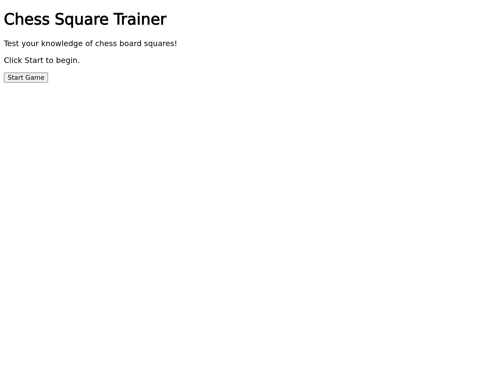
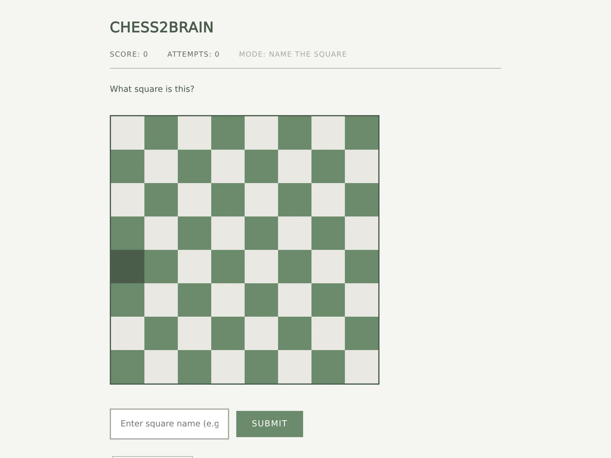

# Chess Square Trainer

An interactive web app that helps players learn chess board coordinates. Choose a game mode, start a round, and test your knowledge of all 64 squares.

## Game Modes

### Find the Square

A square name is displayed (e.g. "e4"). Click the matching square on the board.

> 

### Name the Square

A square is highlighted on the board. Type its name (e.g. "e4") into the input field and submit.

> 

## Development

Built with [Gleam](https://gleam-lang.org/) targeting JavaScript, using the [Lustre](https://lustre.build/) framework.

### Prerequisites

- [Gleam](https://gleam-lang.org/) (target is JavaScript)
- [Node.js](https://nodejs.org/) (for Bombadil tests)

### Build and run

```bash
# Build for development
gleam build --target javascript

# Run the dev server (port 1234)
lustre dev
```

### Run tests

```bash
# Gleam unit tests
gleam test --target javascript

# Bombadil property-based UI tests (requires running server)
bombadil test http://localhost:1234 bombadil/chess-trainer.spec.ts --output-path bombadil/results

# Inspect Bombadil results
bombadil inspect bombadil/results
```

## Architecture

The app follows Lustre's Model-Update-View pattern:

- **Model** — holds the game state (score, attempts, current square, mode, history)
- **Update** — pure function that transforms the model on each message
- **View** — renders the model into HTML, dispatching messages on user interaction

Game behaviour is specified in [Allium](https://allium-lang.org/) (`specs/chess-square-trainer.allium`). The spec defines entities, rules, and surfaces — the `trainer.gleam` module implements these rules. Bombadil tests verify the UI matches the spec through property-based fuzzing with temporal logic assertions.

### Module structure

| Module | Responsibility |
|--------|---------------|
| `vibe_chess.gleam` | Main Lustre app (init, update, view) |
| `square.gleam` | Board square types (file, rank, name), parsing, generation |
| `board.gleam` | Board abstraction, random square selection |
| `game.gleam` | Game state machine, score tracking, mode handling |
| `answer.gleam` | Answer recording for both modes |
| `trainer.gleam` | Rule implementations matching the Allium spec |
